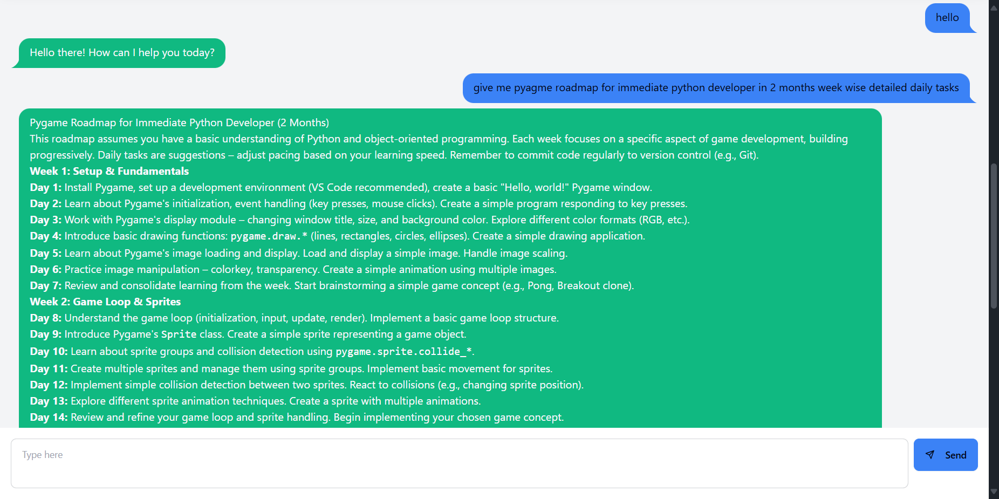

# EchoBot - A Gemini Powered Chatbot

This is a simple and elegant chatbot application built with React and powered by the Google Gemini API. It provides a clean interface for interacting with the generative AI model.

##  Screenshots



## Technologies Used

- **Frontend:**
  - [React](https://reactjs.org/) - A JavaScript library for building user interfaces.
  - [Vite](https://vitejs.dev/) - A fast build tool and development server.
- **Styling:**
  - [Tailwind CSS](https://tailwindcss.com/) - A utility-first CSS framework.
  - [DaisyUI](https://daisyui.com/) - A component library for Tailwind CSS.
- **API:**
  - [@google/generative-ai](https://www.npmjs.com/package/@google/generative-ai) - The official Google Generative AI SDK for Node.js.
- **UI & UX:**
  - [react-icons](https://react-icons.github.io/react-icons/) - A collection of popular icon libraries.
  - [sweetalert2](https://sweetalert2.github.io/) - A beautiful, responsive, customizable, and accessible replacement for JavaScript's popup boxes.
  - [react-markdown-renderer](https://www.npmjs.com/package/react-markdown-renderer) - To render markdown responses from the chatbot.

## Setup and Running the Project

Follow these steps to get the project up and running on your local machine.

### Prerequisites

- [Node.js](https://nodejs.org/en/) (v18.x or higher)
- [npm](https://www.npmjs.com/) (or [yarn](https://yarnpkg.com/))

### Installation & Setup

1.  **Clone the repository:**
    ```bash
    git clone https://github.com/amitKumbhar05/EchoBot.git
    cd echobot
    ```

2.  **Install dependencies:**
    ```bash
    npm install
    ```

3.  **Set up environment variables:**
    - Create a new file named `.env` in the root of your project.
    - Copy the contents of `.env.sample` into the new `.env` file.
    - You'll need to add your Google Gemini API key to the `.env` file:
      ```
      VITE_GEMINI_API_KEY=YOUR_API_KEY
      ```
    - You can get your API key from [Google AI Studio](https://aistudio.google.com/app/apikey).

### Running the Application

1.  **Start the development server:**
    ```bash
    npm run dev
    ```

2.  **Open your browser:**
    Navigate to `http://localhost:5173` (or the address shown in your terminal).

## Available Scripts

- `npm run dev`: Runs the app in development mode.
- `npm run build`: Builds the app for production.
- `npm run lint`: Lints the code using ESLint.
- `npm run preview`: Serves the production build locally.
